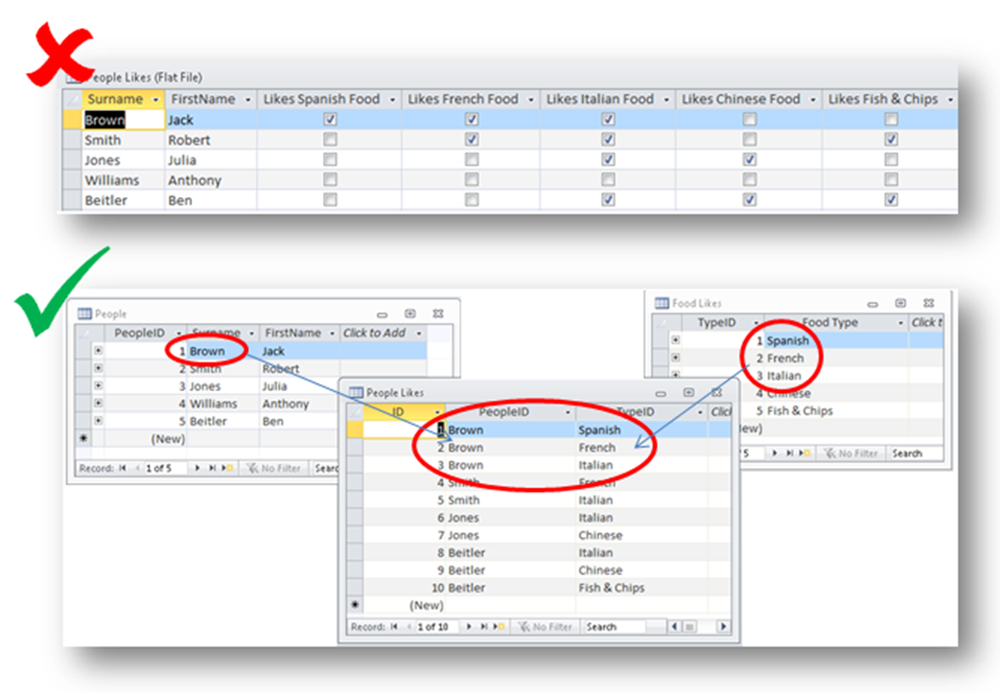
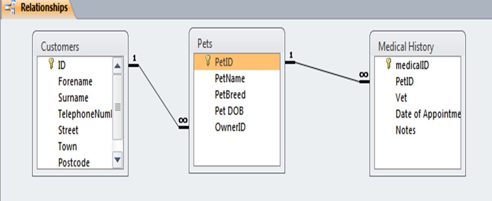

## What is a Database?
- A Database is a collection of related data stored in a logical and structured manner
- A data base contains records and these records are made up from fields

## Database components

### File (table) 
- A collection of related records which contain the same type of information as all the other record
- e.g. Information about ALL students in a class

### Record
- All of the data relating to one item or “thing”.  
- e.g. All information about ONE student in the class

### Field
- Stores one item of data in a record
- e.g. a single characteristic about a student (date of birth, surname etc.)

## Types of Databases
- Databases can be either flat file or relational.

## Flat file databases
- A flat file database usually has one table. In some cases they can have more than one table but they don't have connections between the tables.

### Advantages:
- Easy to set up and understand – no specialist knowledge needed

### Disadvantages:
- May have redundant data
- Potential duplication of data
- Harder to update the data due to duplication
- Records are not unique
- Security is poor as if access is gained all data is readily available
- Harder to perform complex queries

## Relational databases 
- A relational database has more than one table which are linked together by primary and foreign keys.
	- A primary key is used to **uniquely** identify a record
  - A foreign key is a primary key in one table which is used as an attribute in another table to provide a link between tables
  - 
- Sometimes you can't identify a single key field in your database. By combining multiple fields a **Compound Key** can be created.
- A secondary key does exist and is often used to help index results for searching quickly

### Advantages
- Data is only stored once – this avoids data duplication and means that data is only stored once.
- Data integrity is maintained
- Easy to modify the format
- Security is better as sections of the data can be protected individually using authorisation
- More “future proof” as it is easier to update and expand the basic structure than a flat file.
- More complex queries can be run over the data

### Disadvantages
- More difficult to set up

### Data integrity
-  Data integrity refers to the correctness of the data over the lifetime of that data.
-  This means that the data is correct when it enters the database, as it is queried and updated up until the point it is removed from the system.
-  Data must be complete, accurate and consistent.
#### Entity integrity: 
- Every table must have a primary key which is unique and not empty
#### Referential integrity: 
- Foreign key must point to the primary key of another table but can be empty
#### Domain integrity: 
- All attributes in the database are related to the overall domain that the database is working on

### Data Independence:
- In relational databases data is separated meaning that only relevant data is shown.
- This helps to increase the security of the data as only specified users can edit data in the area that they need. 

