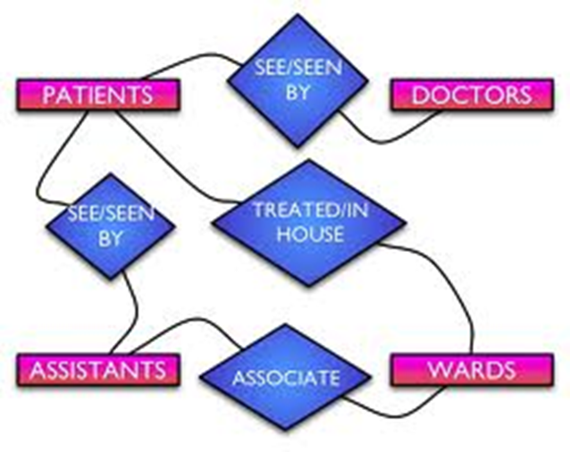

- Analysing data to break it down in to sections involves considering the relationship between each of the files (tables)
- It is necessary to specify entities and attributes in order to be able to create an ERD (Entity relationship diagram)
 
## Parts of a database 
### Entities:
- Entities are the tables in a database
- These may be the customers, pets, medical history

### Attributes:
- Each entity is made up of several attributes
- An attribute is made up of the facts, details and characteristics that make up the entity

### Relationships:
- Relationships are the links between entities
  - Each relationship can be:
	- One to one
	- One to many
	- Many to many

- Data bases normally use a one to many relationship
- The one part is the primary key
- The many part is the foreign key

## Standard Notation:
- There is a standard notation for describing entities
- The entity is written in capital letters
- The primary key id underlined
- Foreign keys are over-lined
## Normalisation
- The process of refining the structure of a database to minimise redundancy and improve integrity is called normalisation.
- When a database has been normalised it is said to be in normal form
- UNF - Unnormalised form
### 1NF - First Normal Form
- A table is in 1NF if it contains **No repeating attributes** or groups of attributes **and data is atomic.**
- **Atomic** data is information which cannot be logically broken down into smaller parts

### 2NF - Second Normal Form
- A table is in 2NF if it is in 1NF **AND** it contains no partial key dependency's
- If a table has a single attribute for a primary key it is usually in 2NF as all of the fields depend on that key
- Compound keys are not 2NF

### 3NF - Third Normal Form
- A table is in 3NF if data items are dependent on on the key, the whole key and nothing but the key
- There are no attributes that in a table that don't depend on the key